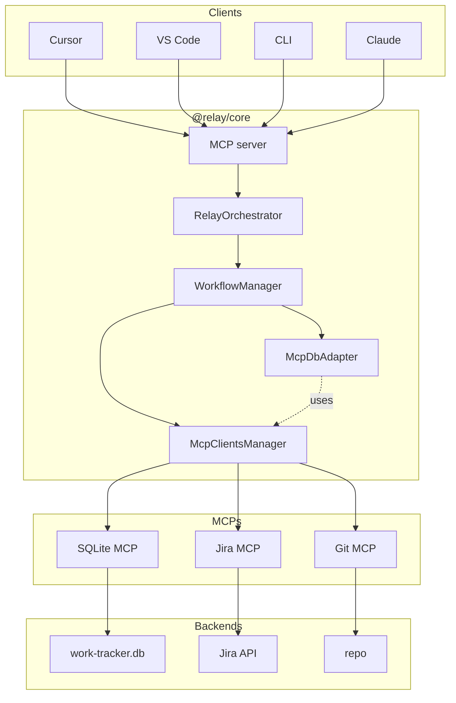

# Relay architecture

Relay is **AI-powered workflow orchestration for development teams**. It composes Jira MCP, Git MCP, and SQLite MCP and adds workflow logic on top. All integration is via MCP — Relay does not call Jira API or Git CLI directly.

## Three layers

| Layer   | Systems                    | Role |
|---------|----------------------------|------|
| Official | Jira, Linear, GitHub       | Source of truth for stories, assignments, status |
| Local   | Relay (SQLite)              | Sessions, micro-tasks, handoffs |
| Code    | Git / GitLab               | Branches, commits, MRs/PRs |

Relay reads from Official and Code, writes to Local, and can update Official (e.g. Jira status) when you start or complete a task.

## Architecture (merged)

Clients → Relay core (request path) → MCPs and backends. **McpDbAdapter** does not talk to SQLite MCP directly; it calls **McpClientsManager.callDBTool()**, so all three MCPs are reached via McpClientsManager.

**Call flow**: User → MCP server (tools) → RelayOrchestrator → WorkflowManager. WorkflowManager calls **McpDbAdapter** for session/handoff/micro-task operations and **McpClientsManager** for Jira/Git tool calls. McpDbAdapter implements those operations by calling McpClientsManager.callDBTool() (SQLite MCP). Relay spawns all three MCPs as subprocesses; tool names are server-dependent (e.g. Jira: `get_jira`, `search_issues`, `transition_issue`; Git: `git_status`, `git_log`; SQLite: `query`).

## Why MCP-only?

- Reuse existing Jira/Git/SQLite MCPs; no direct REST or DB drivers in Relay.
- One protocol for all I/O; easier to swap backends (e.g. different Jira MCP).
- Trade-off: subprocess overhead and dependency on each MCP’s availability.

## Data flow (summary)

- **Check-in**: SQLite MCP (handoffs) + Jira MCP (search_issues) + Git MCP (git_status, git_log) → WorkflowManager synthesizes summary.
- **Start task**: Jira MCP (get_jira, transition_issue) + SQLite MCP (session, micro_tasks); Git MCP → suggested branch.
- **Progress / Complete / Handoff**: SQLite MCP for state; Jira MCP for status on complete.

**McpDbAdapter** is a facade: it translates business operations (e.g. `getPendingHandoffs(devId)`) into SQLite MCP `query` calls and returns typed results. WorkflowManager stays high-level.

## Core modules (`packages/core/src`)

| Module              | Purpose |
|---------------------|--------|
| server.ts           | MCP server entry; tool and resource handlers |
| orchestrator.ts     | Routes tool calls to WorkflowManager |
| workflow-manager.ts  | morningCheckin, startTask, updateProgress, completeTask, createHandoff, endOfDay |
| mcp-clients.ts      | Spawns Jira/Git/SQLite MCPs; callJiraTool, callGitTool, callDBTool |
| db-adapter.ts       | IRelayDb + McpDbAdapter; translates to SQLite MCP queries |
| tools/              | One file per Relay tool (morning-checkin, start-task, …) |
| database/schema.sql | work_sessions, micro_tasks, handoffs, progress_logs, etc. |

## Security and failure modes

- **Credentials**: Relay never reads or stores them; they are passed to MCP subprocesses via env. Each MCP runs in a separate process.
- **Jira/Git MCP down**: Check-in and start/complete degrade (no Jira data or status updates); handoffs and local state still work.
- **SQLite MCP down or DB missing**: All workflow state access fails; ensure DB path exists and schema is applied (e.g. `npm run setup` or first run).

## Database schema (summary)

Workflow-only tables: **developers**, **work_sessions**, **micro_tasks**, **handoffs**, **progress_logs**, **context_notes**, **daily_goals**. See `packages/core/database/schema.sql`.
